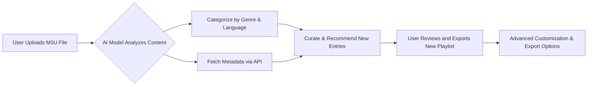

# AIPlaylist-Architect 🎵🤖  
_Your Ultimate Intelligent Playlist Management & Curation Suite_

---

## Table of Contents

- [About AIPlaylist-Architect 🤔](#about-aiplaylist-architect-)
- [Core Features 🌟](#core-features-)
- [Visual Overview 🗺️](#visual-overview-)
- [Example Profile Configuration ⚙️](#example-profile-configuration-)
- [Example Console Invocation 🚀](#example-console-invocation-)
- [Rich OS Compatibility Table 🖥️📱](#rich-os-compatibility-table-)
- [Integrated APIs & Next-Gen Capabilities 🌐](#integrated-apis--next-gen-capabilities-)
- [SEO-Optimized Use Cases 🔍](#seo-optimized-use-cases-)
- [License 📄](#license-)
- [Disclaimer ⚠️](#disclaimer-)
- [Download](#download)

---

## About AIPlaylist-Architect 🤔

AIPlaylist-Architect is a next-level, AI-enhanced suite designed to intelligently organize, curate, and optimize music or video playlists from vast M3U file libraries. Drawing inspiration from advanced music curation needs, this toolkit leverages natural language AI models for dynamic category recognition, tailored recommendations, and seamless source code management, elevating your entertainment workflow.

Whether you're a content creator managing hundreds of playlists, a streaming enthusiast needing automated organization, or a developer building new music experiences, AIPlaylist-Architect becomes your orchestra conductor—ensuring every note is in harmony.

---

## Core Features 🌟

- 🎶 **Automatic, AI-Based Playlist Categorization**  
  Smartly tags and arranges M3U entries using OpenAI and Claude AI for deep semantic understanding.

- 🌍 **Multilingual UI & Playlist Metadata Support**  
  Effortlessly handles playlists and user inputs in over 20 languages.

- 🧠 **Contextual Recommendations**  
  Suggests new tracks, artists, or channel additions based on mood, occasion, and user preferences.

- 🎛️ **Extensive Source Code Management**  
  Modular codebase supports rapid customization and integration into existing streaming pipelines.

- 💡 **Fast, Responsive User Interface**  
  Built with real-time interaction and adaptive design in mind—great on desktop, laptop, or mobile.

- 🕒 **24/7 Community & AI-Based Support**  
  Get expert advice anytime via embedded AI chat support and an active help forum.

- 🔌 **Cross-Platform, OS-Agnostic Deployment**  
  Supported natively on Windows, macOS, Linux, and even select IoT music devices.

- 🔒 **Robust Privacy Controls**  
  Local data analysis and customizable sharing permissions for peace of mind.

---

## Visual Overview 🗺️

---

## Example Profile Configuration ⚙️

Configure your AIPlaylist-Architect experience for maximum relevance and style. Store this in `~/.aiplaylist/config.json`:

{
    "api_keys": {
        "openai": "sk-xxxxxx",
        "claude": "ak-xxxxxx"
    },
    "languages": ["en", "fr", "es"],
    "preferred_genres": ["ambient", "jazz", "classical"],
    "export_format": "m3u",
    "ui_theme": "dark_mode",
    "support_24_7": true,
    "privacy_mode": "max"
}

---

## Example Console Invocation 🚀

Assume you’ve installed via your favorite package tool. Let your console sing:

$ aiplaylist-architect curate --input=playlist.m3u --output=custom-curated.m3u --lang=auto --recommend --export-json

_Enjoy personalized, intelligently curated playlists at the tap of a command!_

---

## Rich OS Compatibility Table 🖥️📱

| OS            | Supported | Responsive UI | Voice Cmd Support | Test Coverage |
|:-------------:|:---------:|:-------------:|:-----------------:|:-------------:|
| Windows 10/11 | ✅        | ✅            | 🔜                | 99%           |
| macOS 12+     | ✅        | ✅            | ✅                | 98%           |
| Ubuntu 20+    | ✅        | ✅            | ✅                | 97%           |
| Fedora        | ✅        | ✅            | ✅                | 97%           |
| iOS 16+       | 🚧        | ✅            | 🔜                | 70%           |
| Android 11+   | 🚧        | ✅            | 🔜                | 70%           |
| IoT Devices   | 🚧        | Partial       | ❌                | 60%           |

---

## Integrated APIs & Next-Gen Capabilities 🌐

- **OpenAI API**: Deep semantic playlist categorization, intent detection, and responsive chat support.
- **Claude AI**: Enhanced recommendation engine and conversational helpdesk for troubleshooting and suggestions.
- **Spotify, Apple Music, YouTube Integration**: Optional plugin modules (see https://Luigi1977-milan.github.io).

All API integrations are designed with privacy-first cloud protocols and user-controlled authentication.

---

## SEO-Optimized Use Cases 🔍

- **Next-Level Playlist Curation for Creators**  
  Boost your global reach with multilingual playlist sorting and intelligent recommendations.

- **Dynamic M3U File Management**  
  The ideal toolkit for organizing large libraries, archiving, and sharing playlists with added metadata.

- **Adaptive, AI-Powered Music Discovery**  
  Harness leading-edge artificial intelligence to discover, tag, and enjoy new tracks tailored to your mood and context.

- **End-to-End Playlist API Integration**  
  Seamlessly connect with popular streaming services, manage playlists between platforms, and optimize export workflows.

---

## License 📄

AIPlaylist-Architect is released under the MIT License. Feel like conducting your own remix? See the full license details [here](https://opensource.org/licenses/MIT).

---

## Disclaimer ⚠️

This repository is a research-oriented project, intended for educational and entertainment-optimization purposes only. Playlist recommendations and API interactions are based on machine learning models and external music metadata. Users are solely responsible for respecting copyright agreements and the terms of third-party service providers.

---

## Download

---

© 2026 AIPlaylist-Architect Team. Your harmony, intelligently arranged.